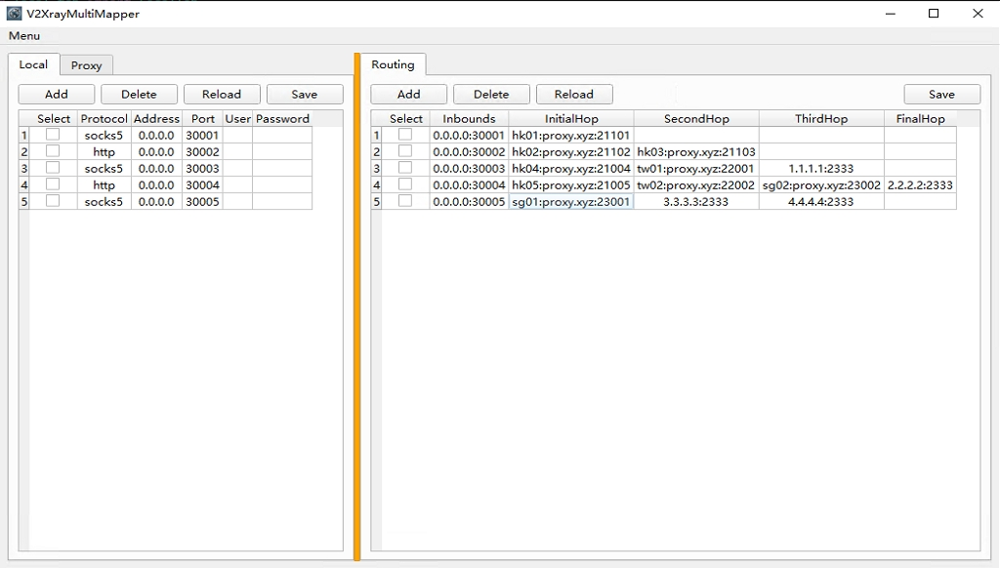
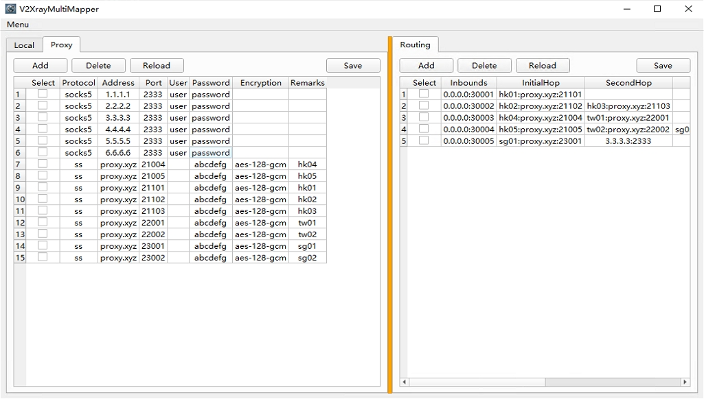
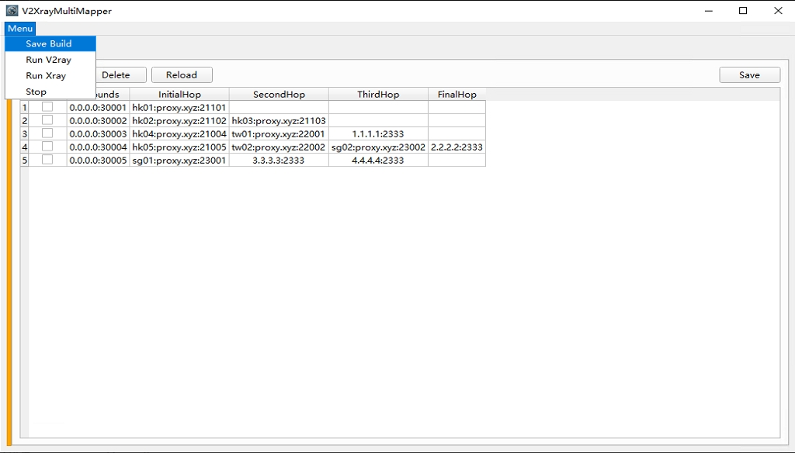

# V2XrayMultiMapper

V2XrayMultiMapper is a dynamic utility crafted for v2ray and xray users, facilitating the complex configuration of multi-entry and multi-exit proxy networks. It offers enhanced control and flexibility for sophisticated network routing.

## Key Features

- **Multi-Entry and Multi-Exit Configuration**: Simplify the setup of multiple entry and exit points, allowing for diverse network routing strategies.
- **Chained Proxy Support**: Create multi-layered proxy chains, optimizing security and network efficiency.

## Protocol Support

### Inbound Protocols
- Currently, V2XrayMultiMapper supports only **HTTP** and **SOCKS5** protocols for inbound connections.

### Outbound Protocols
- For outbound connections, the tool currently supports **Shadowsocks** and **SOCKS5** protocols.

## Current Focus and Limitations

As of now, V2XrayMultiMapper is focused on creating a clean and efficient multi-entry to multi-exit environment. To maintain this simplicity, **traffic routing rules have been omitted**. While this offers a streamlined experience, users requiring advanced routing capabilities may need to wait for future updates or consider additional tools. The project may explore adding these features based on user feedback and the evolving needs of the community.

## Usage Scenarios and Configuration

### Primary Use Case: Local Server Proxy
`V2XrayMultiMapper` was initially developed to address scenarios where ISP proxies (HTTP, SOCKS5) are not directly usable and require other proxies as intermediaries to route traffic effectively. It is primarily intended to function as a local server proxy, rather than a direct client-side tool.

#### Example Configuration:
- Suppose `V2XrayMultiMapper` is running on a host machine within a local network (e.g., `192.168.1.2`) and is set to listen on `0.0.0.0:30001`.
- On a different machine in the same network (e.g., `192.168.1.3`), you can configure a standard proxy client to route traffic through `192.168.1.2:30001`.
- This setup allows the client machine to utilize the ISP proxy via `V2XrayMultiMapper`, effectively bypassing direct usage restrictions.

## Gallery

### Image 1

### Image 2

### Image 3

## Core Versions Included

The V2XrayResourceExtractor, which is part of this tool, already includes:
- v2ray-core version **v4.31.0**
- Xray-core version **v1.8.6**

If you need to update these core components to a newer version, you can download the desired version of `v2ray.exe` and `xray.exe` from their respective official repositories. Replace the existing files in the tool's working directory with the downloaded versions.

### Updating Core Versions
1. Download 'xray/xray.exe' from the [Xray-core releases on GitHub](https://github.com/XTLS/Xray-core/releases).
2. Download 'v2ray/v2ray.exe' from the [v2Ray-core releases on GitHub](https://github.com/v2ray/v2ray-core/releases).
3. Replace the existing files in the V2XrayMultiMapper's working directory with the downloaded files.

## Future Development

The tool is under active development, with plans to expand features and protocol support based on community feedback and demand.

## Setup Instructions

Follow the standard setup procedures for V2XrayMultiMapper. The tool will automatically extract and set up the included versions of v2ray-core and Xray-core.

This tool is an excellent choice for those looking to easily manage complex configurations in v2ray and xray, offering a user-friendly interface to handle intricate proxy setups.
